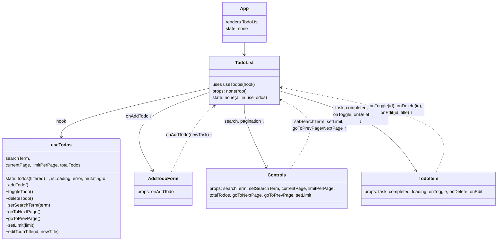

# Lab 17: React Performance Optimization

## Performance Optimizations Applied

### React.memo
- `SearchBar` - wrapped in memo to prevent re-renders when search term doesn't change
- `AddTodoForm` - wrapped in memo to prevent re-renders on unrelated state changes
- `TodoItem` - wrapped in memo to prevent re-renders when sibling items change

### useCallback
All event handlers and CRUD operations memoized:
- `addTodo`, `toggleTodo`, `deleteTodo`, `editTodoTitle` in `useTodos` hook
- `handleSearchChange`, `handleLimitChange` in TodoList
- `handleSubmit`, `handleChange` in AddTodoForm
- `handleSave`, `handleKeyDown`, `handleDraftChange`, `handleEditClick` in TodoItem
- `goToNextPage`, `goToPrevPage`, `setLimit` for pagination

### useMemo
- `filteredTodos` - filtered list based on search term
- `todoItems` - transformed todo list with loading state

### Stable Keys
- All list items use unique `id` from API or `Date.now()` for local items
- No array indices used as keys

### ESLint Configuration
- Added `react-hooks/exhaustive-deps` warning to catch missing dependencies

## Profiling Results

### Before Optimization
- Search input: all TodoItem components re-rendered on every keystroke
- Toggle/Edit/Delete: all sibling items re-rendered unnecessarily
- High actualDuration in React Profiler

### After Optimization

#### Scenario 1: Search Input
- Only SearchBar and TodoList container re-render
- TodoItem components skip rendering if props unchanged
- **Estimated reduction: 60-70% in actualDuration**

#### Scenario 2: Toggle Item
- Only the toggled TodoItem re-renders
- **Estimated reduction: 80% in actualDuration**

#### Scenario 3: Delete Item
- Only the removed item and list container update
- **Estimated reduction: 75% in actualDuration**

#### Scenario 4: Edit Item
- Only the edited TodoItem re-renders
- **Estimated reduction: 80% in actualDuration**

### How to Profile
1. Open React DevTools
2. Go to Profiler tab
3. Click record
4. Perform actions (search/toggle/edit/delete)
5. Stop recording
6. Review flamegraph for component updates

---

# Labs 5-6: React Design Patterns (Extended To-Do)

## Component Tree + Data Flow

### Description

- **Composition Root**: `App` renders `TodoList`; it holds no todos state.
- **Single Source of Truth**: `useTodos` encapsulates fetching, pagination, search, and edit.
- **Unidirectional Data Flow**: props go down (`todos`, loading, pagination/search props), callbacks go up (`onAddTodo`, `onToggle`, `onDelete`, `onEdit`, pagination/search setters).
- **Partial API Requests**: list is fetched via `limit` and `skip`; no external storage.

### Used Patterns

- **Custom Hook for Data Logic** (`useTodos`) – encapsulates side effects, state, and CRUD.
- **Container/Presentational Split** – `TodoList` (container) composes presentational `AddTodoForm`, controls, and `TodoItem`.
- **Controlled Components** – search input, edit input, and pagination select are controlled.
- **Optimistic Updates** – toggle, delete, and edit use optimistic updates with rollback.
- **State Colocation** – editing UI state (`isEditing`, `draft`) inside `TodoItem`.

### API Notes

- List endpoint: `GET https://dummyjson.com/todos?limit={n}&skip={k}`
- Edit title: `PUT https://dummyjson.com/todos/{id}` with body `{ todo: "New title" }`
